# ADR: Autonomous Goal / Project Owner — modular control plane

- **Decision:** build the first Goal / Project Owner as an opt-in first-party
  built-in app named `goal-owner` (provisional app id), not as a new core
  orchestrator or a new scheduler.
- **Scope:** architecture and upstream-compatibility decision only. This ADR
  introduces no runtime behavior.
- **Primary rule:** the app owns goal lifecycle; existing ledgers own work
  truth; existing sessions, workers, acceptance checks, and scheduler own
  execution mechanics.

## Context

Kiro Crew already has most primitives needed for an autonomous owner, but they
solve different problems:

| Existing surface | What it already owns | Boundary that must remain |
|---|---|---|
| `goal-loop` skill | Goal file, DoD file, issue discovery, bounded per-cycle procedure | User-scoped operating recipe; not a product lifecycle |
| `goal-conductor` | Decomposition, child sessions, patrol, acceptance decisions | Legacy transcript-reading conductor; no file writes |
| `goal-ledger-conductor` | Same control loop over structured worker reports | Work-ledger conductor; worker item state is not app state |
| `session_ledger` | One session's durable goal, phase, next intent, tried approaches, event tail | Owner-session recovery state; not a fleet roster |
| `work_ledger` | Conductor goal header, item acceptance, worker binding/report, verdict, close events | Authoritative worker/fleet state; not duplicated in app storage |
| `TaskRunner` | Finite plans, step sessions, retries, tests, self-review, replan, pause/resume | Product-layer finite execution; not a standing goal loop |
| Workflows | Persisted bounded DSL runs, phases, parallel/pipeline agents, restart/subtree operations | Workflow run substrate; not an open-ended owner |
| `CronService` / `CronSDK` | Durable wall-clock scheduling, persistent cron sessions, app ownership and cleanup | Scheduler owns *when*; current SDK does not expose agent-chosen deadlines |
| AutoNudge / monitor | Same-session idle loops and PR observation gating | Session-bound monitoring; not an app-owned goal registry |
| App Kit | Namespaced routes, lifecycle hooks, app storage, app-owned crons, app agents/MCP servers | Replaceable product surface; app code is trusted in-process code |

The existing `goal-loop` and conductor skills prove the behavior can be
expressed today. The missing product surface is an independently addressable
owner: a user must be able to create, pause, resume, inspect, and stop a goal
without keeping one foreground chat tab as its control plane.

## Decision

### 1. Use a built-in app as the replaceable control plane

`goal-owner` contains the product-specific pieces:

- manifest and opt-in enablement (`defaultEnabled: false`);
- an app-owned goal store backed by `AppStorage` with bounded, atomic records;
- `backend.hooks` for startup reconciliation and shutdown cleanup;
- namespaced `RouteRegistry` routes for create, inspect, pause, resume, stop,
  and human-blocker response;
- an app-owned owner skill and explicit owner agent configuration;
- a thin adapter for recording cycle outcomes and lifecycle transitions; and
- optional UI loaded through the manifest's `ui.pages` and the App SDK.

The app must use `backend.hooks`, not a separate `backend.entryPoint`, for this
control plane. In-process hooks can use the existing gateway lifecycle and
app-scoped SDKs. A separate backend process would not share gateway-side
`JobSDK` runner registration or session ownership and would create a second
recovery problem for no benefit.

The first owner agent reuses the semantics of `goal-ledger-conductor`: it
reads the work ledger, dispatches explicit child agents, verifies `done`
claims with the existing acceptance evaluator, replans at round boundaries,
and reports progress. It runs one bounded cycle per wake. The existing global
conductor specs are not edited; if an app-local agent template is needed, it
is namespaced and carries the same host tool references rather than forking
core orchestration code.

### 2. Keep ownership split across three records

There are three records, with one authority for each fact:

| Record | Owner | Holds | Must not hold |
|---|---|---|---|
| `GoalRecord` in `goal-owner` app storage | App routes/hooks and bounded lifecycle adapter | Goal id, user goal/anchor reference, lifecycle, owner job/session references, wake policy, cycle/budget counters, last bounded outcome, references to ledgers | Worker claims, acceptance verdicts, transcripts, full results, credentials |
| Owner `session_ledger` | Owner session | Resumable phase, concrete next intent, tried/rejected approaches, bounded event tail | Per-item roster or a second acceptance state |
| `work_ledger` | Owner for conductor fields; each worker for its report fields | Item title/acceptance/binding, worker status/report, artifacts, PR pointer, verdict, decisions, close events | App lifecycle, scheduler configuration, human budget policy |

The owner session key is the identity for its `work_ledger`. The app stores it
only as a reference needed to reconnect the product view; it does not copy the
ledger contents. A future migration must preserve this one-way reference and
must never make `GoalRecord` a second fleet database.

The app adapter may update only app-owned lifecycle fields and bounded outcome
metadata. It may not let an owner agent alter the original goal, anchor,
budget, or acceptance condition. Human routes own those fields. A goal id is
server-minted and path-safe; unknown, stale, or cross-goal ids are refused.

### 3. Reuse the existing execution flow

```mermaid
flowchart LR
    U[User / Goal Owner UI] --> R[goal-owner app routes]
    R --> G[(GoalRecord<br/>AppStorage)]
    R --> C[ CronSDK<br/>owned recurring wake ]
    C --> S[Persistent owner session]
    S --> O[Owner agent<br/>goal-ledger-conductor semantics]
    O --> SL[(session_ledger<br/>owner recovery)]
    O --> WL[(work_ledger<br/>items and reports)]
    O --> W[Explicit worker sessions]
    W --> WL
    O --> A[Acceptance evaluator]
    A --> WL
    O --> X[Lifecycle adapter]
    X --> G
    O --> N[Existing notifications]
    H[Gateway startup/shutdown hooks] --> G
    H --> C
```

The normal cycle is:

1. The app route validates goal input, creates a `GoalRecord`, and creates one
   app-owned recurring cron job with `CronSDK.add_job_if_absent_async`.
2. The cron job uses a stable persistent session. Its prompt carries only the
   goal reference and the one-cycle contract; it does not ask the agent to run
   an in-process infinite loop.
3. The owner reads `work_ledger` first, then its `session_ledger`, observes the
   whole goal surface, and chooses one bounded action. A delta or newly arrived
   event is evidence, never the only trigger for ranking work.
4. The owner dispatches leaf items to `kirocrew-worker`, or decomposable items
   to `kirocrew-ledger-conductor` only within the existing depth cap. It uses
   existing `session_create`/`session_send` gates and host concurrency limits.
5. Workers report through `work_ledger`. The owner treats `done` as a claim,
   runs the existing acceptance evaluator, records the verdict, and closes or
   replans the item.
6. The owner records a concrete next intent and bounded cycle outcome. The
   lifecycle adapter advances the app record to `running`, `blocked`,
   `paused`, `completed`, `stopped`, or `failed` as appropriate.
7. The owner sends only real signals. Ordinary failures remain work to solve;
   they do not silently convert into a human blocker.

Startup reconciles persisted `GoalRecord`s with app-owned cron jobs and the
owner session reference. It recreates missing wake jobs only for goals whose
state is `running`; `paused`, `stopped`, `completed`, and `failed` goals stay
quiet. Disable/uninstall uses the existing app lifecycle cleanup, including
atomic removal of all app-owned cron jobs and durable job records. Cleanup is
reported if it cannot complete; it is never represented as success by hiding a
residual worker or job.

### 4. Make human blocking explicit

A genuine human blocker is one of:

- an ambiguity no acceptance condition can settle;
- a required approval or policy decision;
- missing credentials or external authorization; or
- a goal change that invalidates the current round.

The owner records `blocked`/`question` in the appropriate ledger, publishes a
bounded notification, and waits for an explicit user response through the app
route or existing governed session-control path. The response resumes the
same owner session; it does not create a second owner or duplicate workers.

Test failures, build failures, stale workers, tool errors, and transient
provider errors are not human blockers. The owner retries, splits, replans,
or selects another item within existing budgets. If the host itself is
unusable, the app records `failed` with the infrastructure reason and stops
its wake job rather than bypassing safety gates.

## Wake and budget policy

The first implementation uses the current `CronSDK` recurring schedule:

- `every_secs` is operator-selected and bounded by the existing cron minimum;
- `persistent_session=True` preserves the owner session across wakes and
  restarts;
- `silent=True` avoids automatic transcript delivery; the owner uses the
  existing notification tools for real signals; and
- the host's existing per-wake timeout, cron failure accounting, and cleanup
  backstops remain authoritative.

The app stores a per-goal cycle/wake budget and refuses further owner work when
that budget is exhausted. Budget checks happen before dispatching workers and
before accepting a new round. Budget increases are human-only. No agent can
raise its own budget, grant itself approval, merge changes, or modify its
anchor/goal definition.

Agent-chosen wake deadlines are explicitly deferred. The draft
[`rfc-perpetual-agent.md`](../request-for-change/rfc-perpetual-agent.md)
proposes `CronSchedule(kind="self")` and `agent_sleep`; it is a valid future
core seam, but adding it now would expand the conflict surface before this
product has measured whether variable cadence is worth the new scheduler
semantics. The app must not implement a private scheduler or a process-local
sleep loop to simulate it.

## Conflict budget and upstream compatibility

The first implementation has a **zero core-file conflict budget**. New code
belongs under the built-in app directory and new documentation/spec files.
Existing core files may change only after a separate decision if a truly
generic, app-neutral seam is missing. An exception must be justified by a
failing integration test and must not encode `goal-owner` names in core.

| Surface | Selected use | Core conflict |
|---|---|---:|
| App discovery/manifest | Built-in directory scan and manifest metadata | 0 |
| Agent/skill registration | App-declared resources and existing bridge materialization | 0 |
| HTTP | App `backend.hooks.routes` through `RouteRegistry` | 0 |
| Lifecycle | Existing `on_app_enable`, `on_gateway_startup`, `on_app_disable` | 0 |
| Persistence | App `AppStorage`; existing atomic writes and app-owned data dir | 0 |
| Scheduling | Existing `CronSDK` with app ownership and add-if-absent | 0 |
| Worker execution | Existing conductor/worker agents and session-control gates | 0 |
| Work truth | Existing `work_ledger` and `accept_eval.py` | 0 |
| Owner recovery | Existing persistent cron session plus `session_ledger` | 0 |
| UI | Manifest page and `@kirocrew/app-sdk` hooks, optional | 0 |
| New wake observation gate | Deferred until a second real consumer warrants it | 0 |
| Agent-chosen next deadline | Deferred to `rfc-perpetual-agent.md` | 0 |

Core modifications are especially disfavored in these files:

- `cron.py`: do not add a `self` schedule kind in the app slice;
- `taskrunner.py`: do not turn finite projects into standing goals;
- `workflows/service.py` or `workflows/store.py`: do not create a second owner
  lifecycle over the workflow registry;
- `agent.py`: do not silently change shipped conductor/worker contracts; and
- dashboard central routes/pages: do not add goal-owner-specific branches when
  manifest routes and UI pages can compose the surface.

## Alternatives considered

### A. Pure skill / `goal-loop`

**Rejected as the product architecture, retained as the fallback.** It has the
smallest diff and is useful immediately for a user who accepts a foreground
session, an anchor directory, `LOOP.md`, and the `kanban-md` dependency. It does
not provide an independently managed goal registry, app lifecycle, app-owned
pause/resume/stop controls, or startup reconciliation. It also relies on a
session-bound monitor rather than an app-owned recurring wake.

### B. Extend `TaskRunner` or Workflows

**Rejected.** These surfaces already solve finite, bounded runs and have their
own persistence, cancellation, approval, review, and replan semantics. Making
them stand for never-done goals would conflate two different lifecycles,
weaken their acceptance boundaries, and create a larger core diff than the
requested feature needs. They remain valid worker implementations for a leaf
that is itself a finite plan.

### C. Add a perpetual mode to core `CronService`

**Deferred, not denied forever.** This is the most complete answer to
agent-chosen cadence and restart catch-up. It is also the largest merge surface:
cron schedule schema, mutation validation, prompt assembly, one-shot execution,
MCP surface, UI, lifecycle, and tests all change together. The existing draft
RFC already owns that proposal. Shipping an app first gives a real use case and
measurements before adding a core schedule kind.

### D. Build a new autonomous orchestration engine

**Rejected.** It would duplicate `SessionManager`, `SubagentManager`,
`work_ledger`, `TaskRunner`, Workflow persistence, and app lifecycle. The
required behavior is composition, not another state machine.

### E. Long-lived process or app-owned sleep loop

**Rejected.** It consumes a resident process, loses the durable deadline on
restart, complicates disable/uninstall, and races the host's existing reaper and
lifecycle cleanup. One bounded scheduled wake is easier to recover and easier
to stop.

## Safety and failure invariants

1. **Opt-in:** the app is disabled by default; enabling third-party executable
   app code remains governed by the existing admission/trust model.
2. **No hidden authority:** app permissions are not treated as a sandbox. The
   built-in status is trusted, and no design claim says in-process app code is
   isolated.
3. **One owner per goal:** one active owner job/session reference per goal;
   startup reconciliation is idempotent; duplicate creation adopts the existing
   record instead of starting another loop.
4. **One source per fact:** app storage for product state, session ledger for
   owner recovery, work ledger for item truth, CronService for scheduling.
5. **Bounded writes:** all app records are size-capped and atomically written;
   malformed records fail closed and do not cause a new owner to be spawned
   blindly.
6. **Acceptance is independent:** worker `done` claims never become verdicts
   without the existing evaluator; a worker cannot rewrite its own acceptance
   bar.
7. **No privilege escalation:** owner and worker agents use explicit named
   specs; no omitted agent name may fall through to a broader default; existing
   approval, governance, sensitive-path, and host concurrency gates remain in
   force.
8. **Safe stop:** pause/stop cancels future wakes and uses existing cooperative
   cleanup. A timeout or uncertain cleanup is reported as residual, not erased.
9. **No duplicate work on resume:** after restart or timeout, the owner reads
   both durable ledgers before dispatching. It adopts existing open items and
   never assumes an absent transcript means an absent worker.
10. **Human-only terminal policy:** completion, abandonment, budget changes,
    and goal changes are recorded through bounded transitions; no owner agent
    can self-grant governance or silently merge/publish work.

## Upstream findings recorded by this review

- Existing app hooks already provide route registration, startup/shutdown
  lifecycle, app-scoped storage, cron ownership, and optional job/spawn
  adapters. No app-specific central route or scheduler branch is needed.
- `AppStorage` is atomic per key but is not a cross-record transaction. The app
  must keep one bounded goal document per write or add a small app-local lock;
  it must not pretend the SDK supplies compare-and-swap semantics.
- `JobSDK` is intentionally a durable registry for one gateway-process runner,
  with process-origin reconciliation and terminal records. It is not a
  recurring LLM owner loop and is not used as one here.
- `EventBus` currently publishes WebSocket events; it does not provide an app
  subscription/replay mechanism. The first owner wake therefore uses the
  existing durable cron schedule, not a claimed event-driven gate.
- The app-token/frontend permission distinction remains important: embedded UI
  uses dashboard authority, while app-owned backend routes and app processes
  must keep their existing server-side scope checks. UI scoping is not a trust
  boundary.
- The durable App SDK review is the existing draft
  [`rfc-app-sdk-durable-jobs-and-view-state.md`](../request-for-change/rfc-app-sdk-durable-jobs-and-view-state.md),
  not a missing file under a shortened name. It confirms that no shared
  `useAppJob` or `useAppViewState` contract exists and that durable work/view
  state is currently app-specific.
- The existing perpetual-agent proposal remains the owner of any future
  `self`-schedule or `agent_sleep` core work. This ADR deliberately does not
  fork or partially implement that proposal.

## Implementation gate for later stages

Before code is written, Stage 3 must specify and test only the app-local
contracts below:

1. bounded `GoalRecord` schema and legal lifecycle transitions;
2. idempotent goal creation/startup reconciliation and cron naming;
3. owner-agent seed and one-cycle prompt contract;
4. lifecycle adapter authorization and human-blocker response path;
5. exact mapping from work-ledger terminal state to goal completion; and
6. disable/uninstall behavior when a worker, owner session, or cron cleanup is
   still live.

If any item requires a `goal-owner` conditional in a core module, stop and
revise this ADR or open a separate core-seam decision before implementing it.
